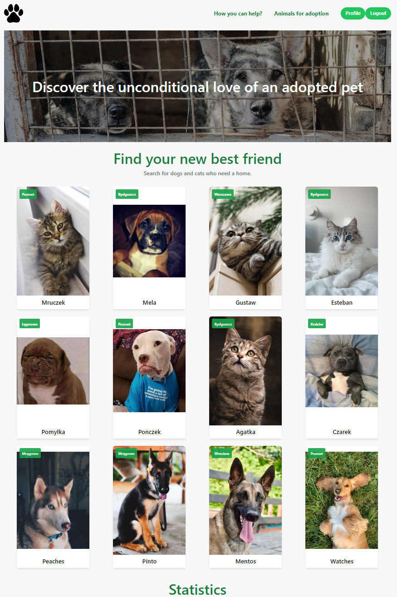

# PawSome - aplikacja do adoptowania zwierząt

# Funkcje:

- Panel Administratora:
  - Dodawanie/Usuwanie zwierzaków do adopcji
  - Dodawanie/Edytowanie/Usuwanie schronisk
  - Akceptowanie/Odrzucanie wniosków o adopcję zwierzęcia
- Panel Użytkownika
  - Zarządzanie swoimi wnioskami (Usuwanie wniosków w trakcie / Przeglądanie zatwierdzonych lub odrzuconych)
- Przeglądanie zwierząt do adopcji (Z filtrowaniem)
- Składanie wniosku na konkretnego zwierzaka
# Technologie:
- React
- Redux
- TailwindCSS
- Nodejs
- Express
